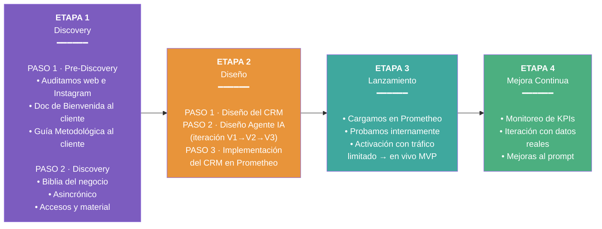
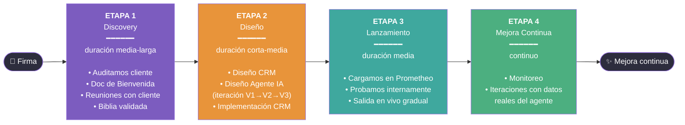
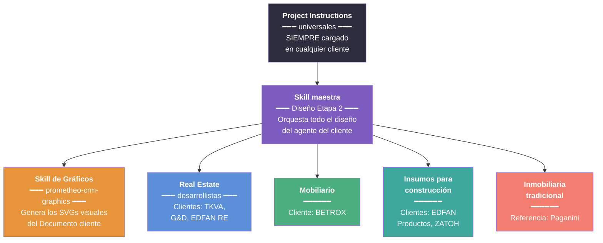
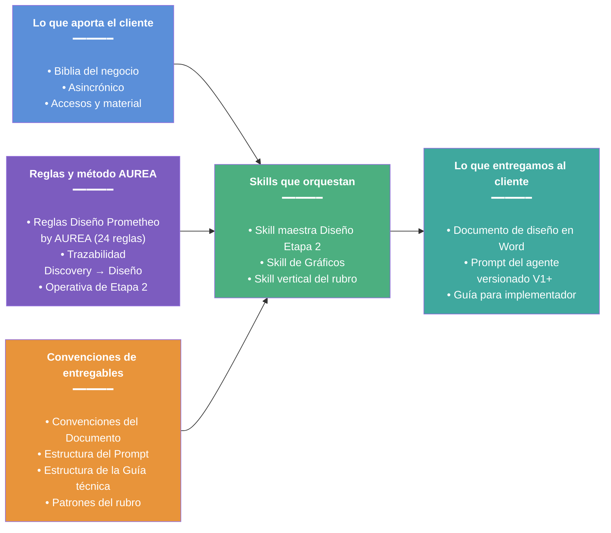

# Diagramas — AUREA Hub × Prometheo

Vista visual de la metodología en 4 ETAPAS. Complementa el `README.md` (manual de instrucciones).

---

## 1. La metodología en 4 Etapas

Cada Etapa tiene **iteración y validación con el cliente**. No hay entregables cerrados de una sola pasada.

---

## 2. Flujo cronológico de un proyecto típico

**Duración total típica:** entre la firma del contrato y el lanzamiento del agente en vivo, un proyecto promedio para cliente de escala media (tipo TKVA o EDFAN) lleva un período largo. Lo importante es el ritmo de iteración, no la velocidad.

---

## 3. Skills por rubro

**Regla:** siempre se cargan las Project Instructions universales + la Skill maestra de Diseño Etapa 2 + la Skill vertical del rubro del cliente.

---

## 4. Relaciones entre archivos clave

---

**Para el manual de instrucciones detallado de cada archivo, ver `README.md`.**
